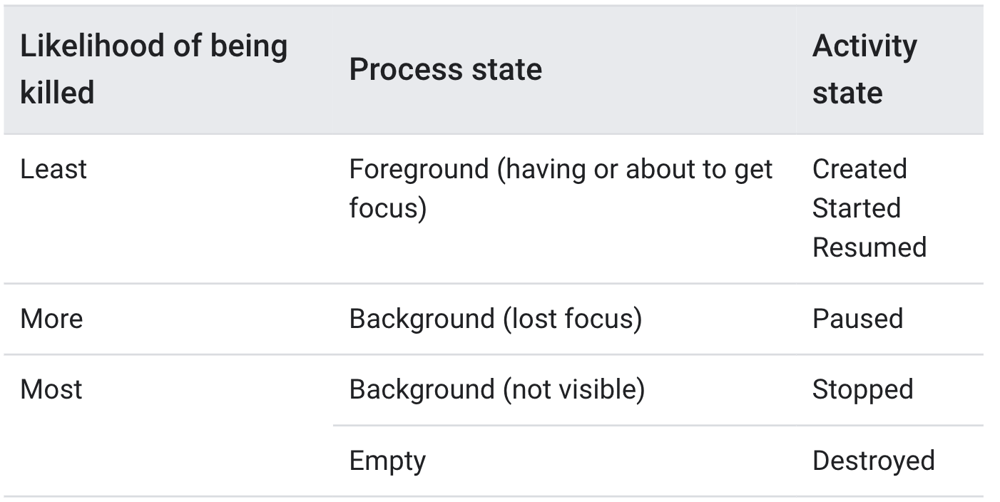

# Understand the Activity Lifecycle



## Lifecycle Callback

Each callback allows you to perform specific work that's appropriate to a given change of state

Doing the right work at the right time and handling transitions properly make your app more robust and performant

**Good implementation of the lifecycle callback helps to avoid....**

* Crashing
* Consuming valuable system resources meaninglessly 
* Losing user's progress -- can't know what to do when they leave and return at a later time
* Crashing & Losing when screen rotates

Putting code directly into the activity lifecycle callbacks \(ex. onStart\(\)\) is  **NOT recommended!**

Instead add logic into a independent, lifecycle-aware component

* can reuse the component without duplicates

## onCreate\(\) - Created state

**MUST Implement**

when activity enters Created state, the system invokes onCreate\(\) call back

* declare user interface layout
  * setContentView\(\)
  * Instead using xml file, you create new View - ViewGroup, then pass the root ViewGroup to setContentView
* perform basic application startup logic 
  * should happen **only once** for the entire life of the activity
  * ex\) binding data to list / associate with ViewModel / instantiate class-scope variable
* receives `savedInstanceState`
  * `Bundle`containing activity's previously saved state
  * **override fun onRestoreInstanceState\(\)**
    * call only when data is previously saved by **override fun onSaveInstanceState\(\)**
    * onSaveInstanceState\(\) invoked when activity may be temporarily destroyed
    * Bundle is same as the one used in onCreate\(\)
* ON\_CREATE event for @OnLifecycleEvent annotation

## onStart\(\) - Started state

when activity enters Started state, the system invokes onStart\(\) call back

* visible to user
* prepares for the activity to enter the foreground and become interactive
  * app initializes the code that maintains the UI
* completes very quickly
* If you initialize something after the ON\_START event, release or terminate it after the ON\_STOP event

## onResume\(\) - Resumed state

when activity enters Resumed state, activity comes to the foreground, the system invokes onResume\(\) call back

* Interacts with user
* App stays in this state, until something happens to take focus away
  * ex\) receiving phone call / user navigates to other app / device screen turning off
* **DO**
  * Initialize components that you release during onPause\(\) 
  * If you initialize after the ON\_RESUME event, release after the ON\_PAUSE event

## onPause\(\) 

* activity is no longer in the foreground \(it may still visible in multi-window mode\)
  * expect to resume shortly
* **When activity may pause?**
  * focus is taken away
  * in multi-window mode, one app\(window\) has focus at any time and rest of windows stay paused
  * a new, semi-transparent activity opens \(ex.dialog\)
    * activity is partially visible but not in focus -- remains paused
* **DO**
  * pause for adjust operations that should not continued \(or continue in moderation\)
  * stop any functionality
  * release system resources
    * yet, paused activity still can be seen by user \(in multi window\)
    * so fully releasing or adjusting UI related resources is not recommended \(use onStop\(\) instead!\)
* **DO NOT**
  * save application or user data / make network calls / execute database transactions
    * execution is very brief, and does not necessarily afford enough time to perform
    * use onStop\(\) instead
* Paused state --&gt; Resumed state
  * the system keeps the Activity Instance resident in memory, recalling that instance when the system invokes onResume\(\)
  * in this case, **no need to re-initialize** components
* Paused state -&gt; Stoped state
  * completely invisible to user

## onStop\(\)

* activity is no longer visible to user
* When activity may stop?
  * when a newly launched activity covers the entire screen
  * when activity has finished running, and is about to be terminated
* DO
  * lease or adjust resources that are not needed while the app is not visible to the user
  * perform relatively CPU-intensive shutdown operations
    * save information to a database
* Activity object is kept **resident in memory**
  * _It maintains all state and member information_
  * but is not attached to the window manager.
* The system also **keeps track of the current state for each View object** in the layout
  * The system might destroy process to recover memory, but still system retains the state of the View
* Paused state --&gt; Restart state
  * comes back to interact with the user
* Paused state -&gt; Destroyed state

## onDestroy

* When activity may destroyed?
  * activity finishing
    * user completely dismissing activity
    * calls `finish()`
  * system temporarily destroying activity due to configuration change

    * ex\) device rotation / multi window mode
    * the system **immediately creates a new activity instance** and then calls `onCreate()` on that new instance in the new configuration
    * ⭐️ To prevent losing data, use `ViewModel` object to contain the relevant view data for your Activity ⭐️

## Activity state and ejection from memory

* The system kills processes when it needs to free up RAM
  * The likelihood fo being killed depends on Process state and Activity state
* The system never kills an activity directly to free up memory. Instead, i**t kills the process it self in which the activity runs**
  * _destroying activity and everything else running in the process_

## Saving and Restoring transient UI states

### Saved Data \(Instance State Bundle\)

* When the activity is destroyed due to system constraints, you should preserve the user’s transient UI state
  * using a combination of `ViewModel`, `onSaveInstanceState()`, and/or local storage
  * onSaveInstanceState\(\) incurs serialization/deserialization costs
* **When unexpected destroy of activity by system constraints happens...**
  * ex\) configuration change / memory pressure
  * the actual activity instance is gone, yet system still remembers that it existed
  * system creates a new instance of that activity using a set of _saved data_ 
    * saved data \(**instance state**\)
      * describes the state of the activity when it was destroyed
      * collection of key-value pairs stored in a `Bundle` object
      * save information about each `View` object in your activity layout
      * appropriate for only trivial amount of data
        * it requires serialization on the main thread and consumes system-process memory
        * _Thus, combining onSaveInstanceStat\(\) and ViewModel methods is recommended_
    * So, if your activity instance is destroyed and recreated, the state of the layout is restored to its previous state with no code required by you
      * **To restore state of views, each view must have a unique ID, supplied by the `android:id` attribute**

### onSaveInstanceState\(\)

* Invoked by system when activity unexpectedly begins to stop due to **system constraints**
* activity can save state information to an instance state bundle
* By default, method saves transient information about the **state of the activity's view hierarchy**
* To save additional instance state information for your activity
  * you must override `onSaveInstanceState()`
  * add key-value pairs to the `Bundle` object

