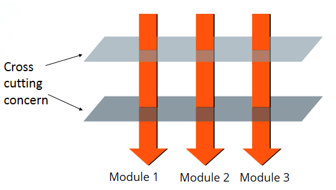

# 11장 시스템

> 복잡성은 죽음이다.
>
> 개발자에게서 생기를 앗아가며 제품을 계획하고 제작하고 테스트하기 어렵게 만든다

높은 추상화 수준, 시스템 수준에서도 깨끗함을 유지하는 방법


### 시스템 제작과 사용 분리

#### 제작construction과 사용use는 아주 다르다

* 소프트웨어 시스템은 준비과정과 런타임 로직을 분리해야 한다
  * 준비과정 - 애플리케이션 객체를 제작하고, 의존성을 서로 '연결'
  * 런타임 로직 - 준비 과정 이후에 이어지는,,,
* 관심사concern 분리가 중요
  * 쳬계적이고 탄탄한 시스템을 만들고 싶다면 모듈성을 깨서는 안된다
  * 설정 논리는 일반 실행 논리와 분리해야 모듈성이 높아진다!

#### 관심사 분리를 하지 않고 런타임 로직, 객체 생성 로직이 뒤섞인 예)

```java
public Service getService() {
    if (service == null) {
        service = new MyServiceImpl(...); // 모든 상황에 적합할까?
    }
    return service;
}
```

* 초기화 지연Lazy Initilazation (계산 지연Lazy Evaluation)
  * 장점&#x20;
    * 실제로 필요할 때 까지 객체를 생성하지 않으므로, 불필요한 부하 없음&#x20;
    * 애플리케이션 시작 시간이 빠름
    * 어떤 경우에도 null 포인터 반환하지 않음
  * 단점
    * getService() 메서드가 MyServiceImpl과 생성자 인수에 명시적으로 의존 -> 해당 객체를 사용하지 않더라도 의존성을 해결하지 않으면 컴파일이 안됨
    * 테스트를 할 때 테스트 전용 객체(TEST DOUBLE, MOCK OBJECT)를 service 필드에 할당해야 함
    * 책임이 둘 (객체 생성, service 반환) -> 단일 책임 원칙SRP 깨짐

#### Main 분리

시스템 생성과 관련한 코드는 모두 main이나 main이 호출하는 모듈로 옮기고, 나머지 시스템은 모든 객체가 생성되었고, 모든 의존성이 연결되었다고 가정


제어흐름

* main(시스템에 필요한 객체 생성, 애플리케이션에 넘김) -> 애플리케이션(전달받은 객체 사용)
* 이때 애플리케이션은 Main이나 객체가 생성되는 과정을 전혀 모름

#### 팩토리

객체가 생성되는 시점을 애플리케이션이 결정할 필요가 있을 때 (ABSTRACT FACTORY 패턴)


제어흐름

* main(객체 생성하는 Factory실제 구현) -> 애플리케이션(객체 생성 시점을 통제, BUT 실제 구현은 모름)
* EX) 애플리케이션인 OrderProcessing 은 LineItem이 어떻게 생성되는 구적인 방법은 모르지만, LineItmeFactoryImplementation을 통해 객체 생성 시점을 통제할 수 있음

#### 의존성 주입Dependency Injection

제어 역전Inversion of Control 기법을 의존성 관리에 적용한 메커니즘

하나의 객체가 다른 객체의 의존성을 제공하는 테크닉 & 객체의 생성과 사용의 관심을 분리 -> 결합도 낮춤, 가독성과 코드 재 사용성을 높여줌

* 제어역전
  * 한 객체가 맡은 보조 책임을 새로운 객체에게 전적으로 떠넘김
  * 새로운 객체는 넘겨받은 책임만 맡으므로 단일 책임 원칙SRP 지키게 됨

의존성 관리 맥락에서는 객체는 의존성 자체를 인스턴스로 만드는 책임은 지지 않고, 대신 이런 책임을 다른 '전담' 메커니즘에 넘김

> 의존성 주입 적용 유형
>
> * 생성자 주입
> * Setter 를 통한 주입
> * 인터페이스를 통한 주입


???? p198

```java
MyService myService = (MyService)(jndiContext.lookup("NameOfMyService"));
```

* 호출하는 객체는 실제로 반환되는 객체의 유형을 제어하지 않음
  * 대신 호출하는 객체는 의존성을 능동적으로 해결
* 진정한 의존성 주입은 -> 클래스는 의존성을 해결하려 시도하지 않음(수동적)
  * 대신 의존성을 주입하는 방법으로 setter 메서드나 생성자 인수를 제공


DI 컨테이너는 요청이 들어올 때 마다 필요한 객체의 인스턴스를 만든 후, 생성자 인수나 설정자 메서드를 사용해 의존성을 설정

* EX) 자바 DI 컨테이너
  * 객체 사이 의존성은 XML 파일에 정의, 이름으로 특정한 객체를 요청

DI를 사용하더라도 초기화 지연으로 얻는 장점도 얻을 수 있음

* 대다수의 DI 컨테이너는 필요할 때 까지는 객체를 생성하지 않고, 대부분 계산 지연이나 비슷한 최적화에 쓸 수 있도록 팩토리를 호출하거나 프록시를 생성하는 방법 제공

### 확장

'처음부터 올바르게' 시스템을 만들 수는 없다 -> 관심사를 적절히 분리해서 관리한다면 소프트웨어 아키텍쳐는 점진적으로 발전할 수 있다

관심사를 적절하게 분리하지 못한다면 유기적인 성장이 어려움

* Ex) EJB1 EJB2 엔티티 구현
  * 비즈니스 논리가 EJB2 애플리케이션 '컨테이너'에 강하게 결합됨
    * 클래스를 생성할 때 컨테이너에서 파생해야 하고, 컨테이너가 요구하는 생명 주기도 제공해줘야 함
  * 이 때문에 독자적인 단위테스트가 어렵고, 재사용 거의 불가능

#### 횡단 관심사 cross-cutting corners

핵심 기능들 사이사이에 삽입되어야 하는 기능들/관심들

* ex) 로깅, 보안, 트랜젝션 처리
* 중복된 부가 기능들이 흩어져 있음 -> 이 관심사를 분리할 수는 없을까?



#### 관점 지향 프로그래밍 AOP (Aspect Oriented Programming)

* 횡단 관심사 (흩어진 관심사)의 분리를 허용함으로써 모듈성을 증가시키려는 프로그래밍 패러다임
* 횡단 관심사에 대처해 모듈성을 확보하려는 방법론
* 소스코드 상에서 각각의 관점을 핵심적인 관점, 부가적인 관점으로 나누고 그 관점을 기준으로 분리
* 관심/관점(aspect)
  * 특정 관심사를 지원하려면, 시스템에서 특정 지점들이 동작하는 방식을 일관성 있게 바꿔야 한다 (??)


### 자바에서 사용하는 관점/관점과 유사한 매커니즘

#### 1) 자바 프록시

개별 객체나 클래스에서 메서드 호출을 감싸는 경우

클래스 프록시를 사용하려면 CGLIB, ASM, Javassist 같은 바이트코드 처리 라이브러리가 필요함

> 프록시 패턴
>
> 다른 객체에 대한 접근을 제어하기 위한 대리자, 또는 자리채움자 역할을 하는 객체를 두는 패턴
>
> 실제로 그 객체를 사용할 수 있을 때까지 객체 생성과 초기화에 들어가는 비용 및 시간을 들이지 않기 위해 객체 접근을 제어


2\) 순수 자바 AOP 프레임워크

자바 프록시를 자동화해서 간편하게 사용할 수 있음

#### 3) AspectJ 관점

언어 차원에서 관점을 모듈화 구성을 지원하는 자바 언어 확장

관점을 분리하는 강력하고 풍부한 도구 집합을 제공하지만, 새 도구와 새 언어 문법을 익혀야 한다는 단점이 있음


### 테스트 주도 시스템 아키텍쳐 구축

최선의 시스템 구조는 각기 POJO 객체로 구현되는 모듈화된 관심사 영역(도메인)으로 구성된다

이렇게 서로 다른 영역은 해당 영역 코드에 최소한의 영향을 미치는 관점이나 유사한 도구를 사용해 통합한다

이런 구조 역시 코드와 마찬가지로 테스트 주도 기법을 적용할 수 있다


> POJO
>
> Plain Old Java Object
>
> 특정 기술에 종속되지 않은 오래된 방식의 순수한 자바 객체 (?)
>
> 진정한 POJO란 객체지향 원리에 충실하면서, 환경과 기술에 종속되지 않고 필요에 따라 재활용 될 수 있는 방식으로 설계된 오브젝트


### 의사 결정을 최적화하라

가능한 마지막 순간까지 결정을 미루는 방법이 어쩌면 최선의 방법일 수도 있다

* 최대한 정보를 모아서 최선의 결정을 내리자&#x20;

> 관심사를 모듈로 분리한 POJO 시스템은 기민함을 제공한다
>
> 이런 기민함 덕택에 최신 정보에 기반해 최선의 시점에서 최적의 결정을 내리기가 쉬워지고, 결정의 복잡성도 줄어든다


### 명백한 가치가 있을 때 표준을 현명하게 사용하라

과장되게 포장된 표준에 집착하지 말자

### 시스템은 도메인 특화 언어가 필요하다

DSL 도메인 특화 언어

* Domain Specific Language
* 간단한 스크립트 언어나 표준 언어로 구현한 API
* 도메인 개념과 그 개념을 구현한 코드 사이에 존재하는 '의사소통 간극'을 줄여줌
* 고차원 정책에서 저차원 세부사항에 이르기까지 모든 추상화 수준과 모든 도메인을 POJO로 표현할 수 있다


### 결론

실제로 돌아가는 가장 단순한 수단을 사용하자

* 모든 추상화 단계에서 의도를 명확하게 표현하기
* POJO를 작성 -> 관점/관점과 유사한 메커니즘을 사용해 각 구현 관심사를 분리

