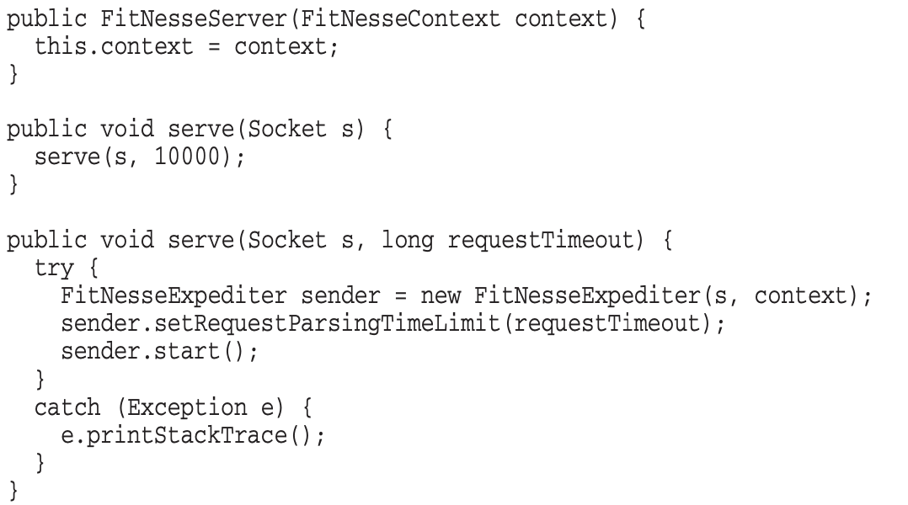
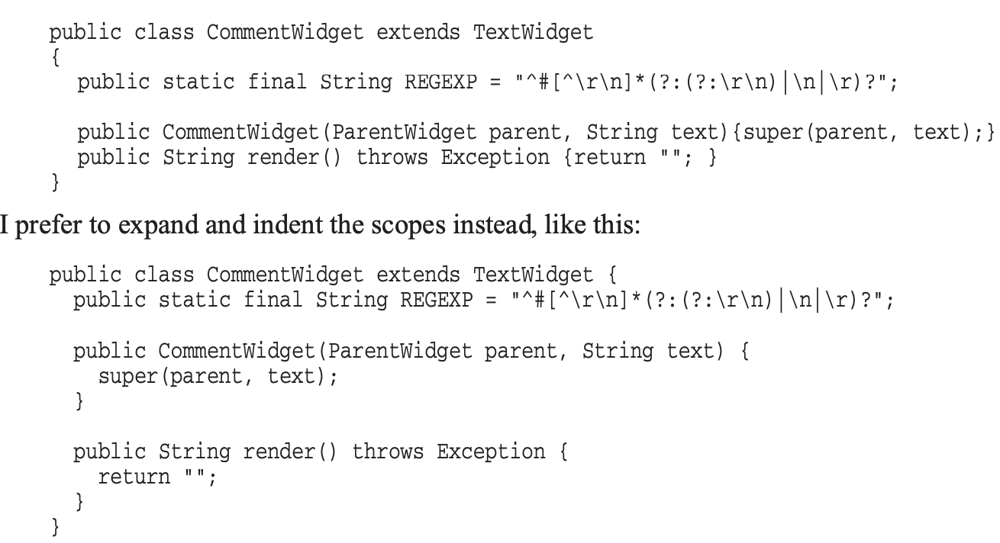

# 5장 형식 맞추기

#### 코드 형식이 중요한 이유 

* 코드 형식은 의사소통의 일환
* 코드의 가독성은 앞으로 바뀔 코드 품질에 큰 영향을 미침 -> 생성산, 유지보수 용이성, 확장성에 계속 영향을 미침

\

#### 원활한 소통을 장려하는 코드 형식 

\

**적절한 행 길이 유지하기**

* 작은 파일이 큰 파일보다 이해하기 쉽다
* 유명 큰 프로젝트들의 파일 크기도 200\~ 500줄 수준

\

**신문 기사처럼 작성하기**

* 소스 파일의 첫 부분은 고차원개념과 알고리즘 -> 차차 내려갈 수록 세부 사항, 세부 내역, 저차원 함수 기술하기

\

**개념은 빈 행으로 분리하기**

* 빈 행은 새로운 개념을 시작한다는 시각적 단서 -> 코드 가독성에 도움을 줌

\

**세로 밀집도**

* 서로 밀접한 코드 행은 세로로 가까이 놓기

\

**수직거리**

* 서로 밀접한 개념은 세로로 가까이두고, 이리저리 찾으러 돌아다니는 불필요한 노력을 하지 않게 하자
* protected 변수를 피해야 하는 이유! —— 
*
  * 밀접한 개념은 한 파일에 속하는 게 좋음

 하위 클래스에서 접근하는 것 자체가 밀접한 개념을 분리시키는 거라서??

<figure><figcaption></figcaption></figure>

<figure><figcaption></figcaption></figure>

**변수 선언**

* 사용하는 위치에 최대한 가까이 선언하기
* 각 함수 맨 처음 / 루프를 제어하는 변수인 경우 루프 문 내부 / 블록 상단이나 루프 직전

\

**인스턴스 변수**

* 클래스 맨 처음에 선언하기
* 잘 알려진 위치에 변수를 모으는 게 중요 (중간에 꽁꽁 숨겨놓지 말자 -\_-)

\

**종속 함수**&#x20;

* 한 함수가 다른 함수를 호출한다면, 두 함수는 세로로 가까이 배치하기
* 호출하는 함수를 호출되는 함수보다 먼저 배치하기
* 호출되는 함수를 찾기 쉬워지고, 모듈 전체의 가독성이 높아짐

\

**상수를 적절한 수준에 두는 좋은 예)**

* getPageNameOrDefault() 함수 내에서 defaultPageName 변수 대신에 직접 “FrontPage” 를 사용할 수도 있지만, 그렇게 되면 잘 알려진 상수가 적절하지 않은 저차원 함수에 묻히게 됨
* 상수를 알아야 마땅한 함수에서 실제로 사용하는 함수로 상수를 넘겨주는 방법이 더 좋음

<figure><figcaption></figcaption></figure>

<figure><figcaption></figcaption></figure>

\

**개념적 유사성**

* 친화도가 높을 수록 코드를 가까이 배치
* 친화도가 높은 요인
*
  * 한 함수가 다른 함수를 호출해서 생기는 직접적인 종속성
  * 변수와 그 변수를 사용하는 함수
  * 비슷한 동작을 수행하는 함수들

\

———

\

**가로 형식 맞추기**

* 120자 정도의 짧은 행 길이 추천

\

**가로 공백과 밀집도**

* 밀접한 개념인 함수와 인수는 공백 없이
* 할당 연산자를 강조하기위해 앞뒤로 공백넣기

* 연산자 우선순위 구분을 위한 공백
*
  * 잘 지켜지지 않는 경우가 많음;

\

<figure><figcaption></figcaption></figure>

**가로 정렬**

* 이런 정렬은 별로 유용하지 않음

<figure><figcaption></figcaption></figure>

\

**들여쓰기**

* 범위scope로 이뤄진 계층을 표현
* 들여쓰기를 사용해야 이해할 수 있음\

<figure><figcaption></figcaption></figure>

\

<figure><figcaption></figcaption></figure>

**들여쓰기 무시**

* 한줄로 무시할 수도 있지만, 아래처럼 범위를 제대로 표시하자

<figure><figcaption></figcaption></figure>

\

**팀규칙**

* 무엇보다 우선시 되어야 하는 건 팀규칙\~
