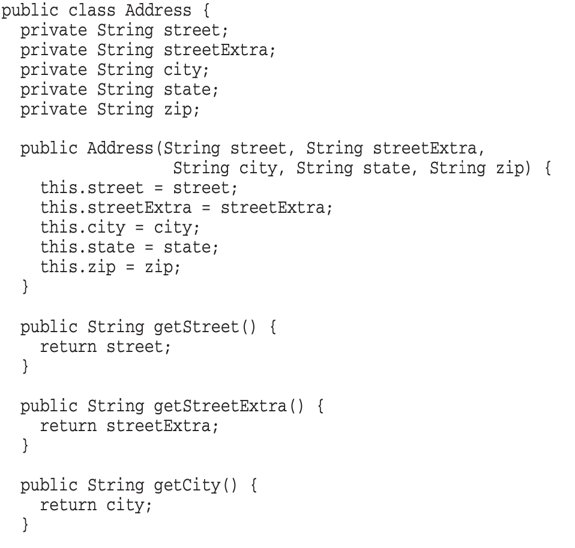

# 6장 객체와 자료구조

#### 객체 <a href="#id-6" id="id-6"></a>

* 추상화 뒤로 자료를 숨긴 채 자료를 다루는 함수만 공개
* 객체지향적 코드
*
  * 기존 함수를 변경하지 않으면서 새 함수를 추가하기 쉽다
  * BUT 새로운 함수를 추가하려면, 모든 클래스를 고쳐야 한다
* 새로운 자료 타입을 추가하는 유연성이 필요하다면 적합

\


#### 자료구조 <a href="#id-6" id="id-6"></a>

* 자료를 그대로 공개하며, 별다른 함수를 제공하지 않음
* 절차적인 코드
*
  * 기존 자료구조를 변경하지 않으면서 새 함수를 추가하기 쉽다
  * BUT 새로운 자료구조를 추가하려면, 모든 함수를 고쳐야 한다
* 새로운 동작을 추가하는 유연성이 필요하다면 적합

\


 모든 것이 객체라는 것은 미신, 때로는 단순한 자료 구조와 절차적인 코드가 가장 적합한 상황도 있다

\


#### 예) <a href="#id-6" id="id-6"></a>

**객체 지향적인 도형 클래스**

* area() 는 다형적, Geometry 같은 클래스 불필요
* 새 도형을 추가하고 싶다면? -> 기존 함수들 변경 없이 쉽게 추가가능
* 새 함수를 추가하고 싶다면? -> 도형 클래스 전부를 고쳐야 함 ;;
*
  * 이 문제를 해결하기 위해서 VISITOR 혹은 Dual-patch 등과 같은 기법을 사용
  * 하지만 일반적으로 절차적 프로그램에서 볼 수 있는 구조를 반환한다거나, 캡슐화를 위반한다든가 등등 문제점이 있음

<figure><figcaption></figcaption></figure>

\


<figure><figcaption></figcaption></figure>

\


**절차적인 도형 (자료구조)**

* Geometry 클래스에 새로운 함수를 추가하고 싶다면? -> 도형 클래스 변경없이 쉽게 가능
* 새 도형을 추가하고 싶다면? ->  Geometry 클래스에 있는 **모든** 함수를 고쳐야 한다 ;;

<figure><figcaption></figcaption></figure>

 e.png>)\


#### 디미터 법칙 Law of Demeter <a href="#id-6-lawofdemeter" id="id-6-lawofdemeter"></a>

* 객체 내부 구조에 강하게 결합되지 않도록 협력 경로를 제한하기
*
  * 결합도를 줄이기 위한 법칙
  * 객체는 조회 함수 등으로 내부 구조를 공개하면 안됨
  * Shy code 작성하기
  *
    * 불필요한 어떤 것도 다른 객체에게 보여주지 않으며, 다른 객체의 구현에 의존하지 않는 코드
* 클래스 C 의 메서드 f는 다음과 같은 객체의 메서드만 호출해야 한다
*
  * 클래스 C
  * f 가 생성한 객체
  * f 의 인수로 넘어온 객체
  * C 인스턴스 변수에 저장된 객체

```
Class Demeter {
    Private:
        A *a;
        Int func();
 
    Public:
        // …..
        void example(B& b);
}
 
    Void Demeter: example(B& b) {
        C c;
        Int f = func();    // 자신
        b.invert();    // 메서드로 넘어온 인자
        a = new A();
        a->setActive();   // 자신이 생성한 객체
        c.print();   // 직접 포함하고 있는 객체
    }  
}
```

**디미터 법칙 위반 - 기차 충돌 train wreck**

* 전송자가 수신자의 내부 구조를 물어보고, 반환받은 요소에 대해 연쇄적으로 메시지를 전송하는 것
* 내부구조가 노출됨 -> 결합도가 높아짐 -> 변경에 취약

```
Final String outputDir = ctxt.getOptions().getScratchDir().getAbsolutePath();
```

만약 ctxt, options, scratchDir 이 자료구조라면 -> 디미터 법칙 적용 X

* 자료구조는 내부를 노출하는 게 당연함

\


만약 객체라면, 디미터 법칙 위반

* 개선
*
  * 내부구조를 직접 파헤지면서 묻지않도록 해야함
  * 객체에게는 뭔가를 하라고 해야지, 속내를 드러내게 하면 안됨!!!

```
BufferedOutputStream bos = ctxt.createScratchFileStream(classFileName);
```

**BUT 디미터 법칙을 무비판 수용할 경우**

* 퍼블릭 인터페이스 관점에서 객체의 응집도가 낮아질 수 있다
*
  * 내부 구조를 묻지 않도록 위임 메서드를 추가하다보면, 퍼블릭 인터페이스에 연관없는 여러 책임을 가지게 될 수도 있음
* 자료구조의 경우, 내부를 당연히 노출해야 하므로 디미터 법칙을 적용할 수 없는 경우도 있음

\-> 어떤 경우는 캡슐화보다 응집도를 높이고 결합도를 낮추는 선택이 더 좋을 수도, 경우에 따라 다르므로 절대적인 원칙으로 맹신하지 말기!

\


#### 잡종 구조 <a href="#id-6" id="id-6"></a>

* 절반은 객체, 절반은 자료구조인 구조
* 기능욕심 Feature Envy 에 빠지게 될 수 있음
*
  * 다른 함수들도 절차적인 프로그래밍의 자료 구조 접근 방식처럼 비공개 변수를 사용하고 싶어짐,,
* 새로운 함수나 자료 구조를 추가하기 어려우므로, 최대한 잡종 구조는 피하는 게 좋음

\


\


**자료 전달 객체**&#x20;

**DTO - Data Transfer Object**

* 공개 변수만 있고, 함수가 없는 클래스
* 데이터베이스와 통신하거나, 소켓에서 받은 메시지의 구문을 분석할 때 유용

\


**Bean 구조**

* 비공개private 변수를 조회/설정 함수로 조작
* 사이비 캡슐화
*
  * 별다른 이익 없음 ㅎㅎ;

<figure><figcaption></figcaption></figure>

\


\


**활성 레코드**

* DTO의 특수한 형태
*
  * 데이터베이스 테이블, 다른 소스에서 자료를 직접 변환한 결과
* 공개 변수가 있거나, 비공개 변수에 조회/설정 함수가 있고, save나 find 같은 탐색 함수 제공하는 **자료구조**
* **활성 레코드 안에 비즈니스 규칙을 담아서 객체처럼 취급하면 안됨 -> 잡종구조 양산**
