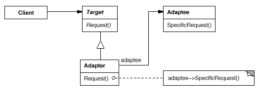
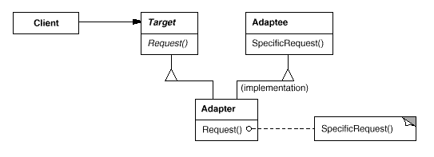

# 어댑터 패턴 Adapter Pattern

* 특정 클래스 인터페이스를 클라이언트에서 요구하는 다른 인터페이스로 변환
* 인터페이스가 호환되지 않아 같이 쓸 수 없었던 클래스를 사용할 수 있게 도와줌

### 사용

* 기존 클래스를 사용하고 싶은데 인터페이스가 맞지 않을 때

## 객체 어댑터 패턴

* 구성
  * Adapter가 Adaptee를 포함하는 관계
* 유연한 설계 가능

### 다이어그램

<figure><figcaption></figcaption></figure>

## 클래스 어댑터 패턴

* 다중 상속을 사용 (자바는 다중 상속을 지원하지 않음)
  * 상속을 받아서 두 인터페이스 모두 호환되는 어댑터 구현
* 기능을 재정의할 수 있음

### 다이어그램

<figure><figcaption></figcaption></figure>

\

##
