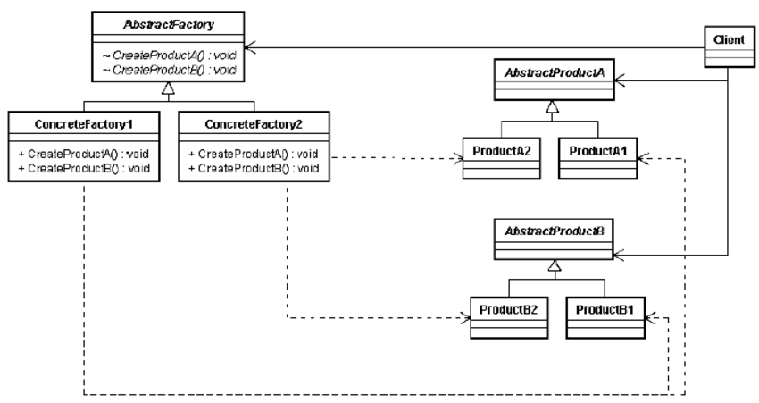

# 팩토리 패턴 - 팩토리 메소드 & 추상 팩토리

## 간단한 팩토리 Simple Factory

* 엄밀하게 패턴은 아님

## 팩토리 메소드 패턴 Factory Method Pattern

* 객체를 생성할 때 필요한 인터페이스를 만든다
* 어떤 클래스의 인스턴스를 만들지는 서브클래스에서 결정
* 클래스 인스턴스 만드는 일을 서브클래스에게 맡긴다 (사용하는 서브클래스에 따라 생산되는 객체 인스턴스가 결정된다)

예)

PizzaStore (추상 생산자 클래스 Creator)

* NYPizzaStore
* ChicagoPizzaStore

### 다이어그램

<figure><figcaption></figcaption></figure>

### 심플 팩토리 vs 팩토리 메소드 패턴

* 심플 팩토리는 일회성, 단순 캡슐화
* 팩토리 메소드는 재사용이 가능한 프레임워크, 서브 클래스를 만들 때 어떤 구상 클래스가 역할을 수행할지 유연하게 정할 수 있음

### 사용

* 어떤 클래스가 자신이 생성해야 하는 객체의 클래스를 예측할 수 없을 때
* 생성할 객체의 책임을 자신의 서브클래스가 지정했으면 할 때

\

——

\

### 디자인 원칙

#### 의존성 뒤집기 원칙 Dependency Inversion Principle

* 추상화된 것에 의존하게 만들고, 구상 클래스에 의존하지 않게 만든다
* 고수준 구성 요소가 저수준 구성 요소에 의존하면 안되고, 항상 추상화에 의존해야 한다!
*
  * 고수준 구성 요소 : 다른 ‘저수준’ 구성 요소에 의해 정의되는 행동이 들어있는 구성 요소 ex) PizzaStore
  * 저수준 구성 요소 : ex) Pizza 객체\

### 의존한다

A -> B

**A는 B에 의존한다. B의 변경이 A 에게 영향을 끼친다**

나쁜 예)

PizzaStore 에서 직접 구상 Pizza를 생성하게 되면, Pizza가 변경될 때 마다 PizzaStore도 영향을 받음

PizzaStore -> 구상 Pizza 의존성을 가지게 됨, PizzaStore가 구상 Pizza에 의존한다\

의존성 뒤집기 예)

추상 클래스 Pizza를 생성, 각 구상 Pizza들은 추상 Pizza에 의존하게 하고

PizzaStore는 추상 클래스 Pizza를 의존하게 만들기

PizzaStore -> 추상 Pizza <- 구상 Pizza 들\

#### 의존성 뒤집기 원칙 가이드라인

* 변수에 구상 클래스의 레퍼런스를 저장하지 않기 (new 쓰지 말고 팩토리 사용하기)
* 구상 클래스에서 <mark style="color:red;">**유도된 클래스**</mark>를 만들지 않기 (??)
  * 추상화된 것으로부터 클래스를 만들기
* 베이스 클래스에 이미 구현되어 있는 메소드를 오버라이드 하지 않기
  * &#x20;베이스 클래스는 모든 서브 클래스에서 공유할 수 있는 것만 정의하기
  * 오버라이드 한다면 베이스 클래스가 제대로 추상화되기 어렵다

——

## 추상 팩토리 패턴 Abstract Factory Pattern

* 구상 클래스에 의존하지 않고도 서로 연관되거나 의존적인 객체로 이루어진 제품군을 생산하는 인터페이스를 제공
* 구상 클래스는 서브 클래스에서 만듬
* 클라이언트와 생산되는 제품을 분리

### 다이어그램

<figure><figcaption></figcaption></figure>

### 팩토리 메소드 vs 추상 팩토리&#x20;

* 팩토리 메소드는 클래스를 사용해서(상속), 추상 팩토리는 객체를 사용해서(객체 구성 composition) 제품을 만든다
* 팩토리 메소드는 클래스 확장하고, 팩토리 메소드를 오버라이드 / 클라이언트는 구상 클래스의 구현을 모르고 추상 형식만 알고 있으면 됨 (구상 형식은 서브클래스가 해결)
* 추상 팩토리는 제품군을 만드는 추상 형식을 제공 / 새로운 종류의 제품 제공이 어려움(기존 추상 클래스 확장이 어려움, 인터페이스부터 다 수정해야 함)

\

\

\
