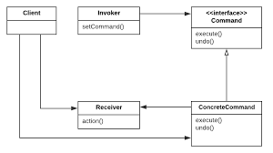

# 커맨드 패턴 Command Pattern

## 커맨드 패턴

* 요청 내역을 객체로 캡슐화해서 객체를 서로 다른 요청 내역에 따라 매개변수화 할 수 있다
* 요청을 큐에 저장하거나 로그로 기록하거나 작업 취소 기능을 사용할 수 있다

### 다이어그램

<figure><figcaption></figcaption></figure>

* Client : ConcreteCommand를 생성하고, Receiver를 설정
* Invoker : execute() 메소드를 호출, 커맨드 객체에게 특정작업을 수행할 것을 요구
* Command : 리시버에게 특정 작업을 수행할 것을 명령
* Concrete Command : 특정 행동과 리시버를 연결 (invoker 에서 execute() 호출로 요청하면 ConcreteCommand 객체에서 리시버에 있는 메소드를 호출해서 그 작업을 처리)
* Receiver : 요구사항을 수행할 때 어떤 일을 처리해야 하는 지 알고 있는 객체

#### 예제

Invoker - RemoteControl

Receiver - Light, GarageDoor

### 사용하는 경우

* 요청받은 연산이 무엇인지, 이를 처리할 객체가 누구인지 아무런 정보없이 임의의 객체에 메시지를 보내야 할 때
* 실행 취소 기능을 지원하고 싶을 때
  * 각 Command를 기록해두었다가 역으로 탐색해서 UnExecute() 수행

### 장점

* 연산을 호출하는 객체와 연산 수행 방법을 구현하는 객체를 분리
* 여러 Command를 합쳐서 복합 명령을 만들 수 있음
* Command를 새로 추가하기 쉬움

### Null 객체

딱히 리턴할 객체도 없고, 클라이언트가 null을 처리하지 않게 하고싶을 때 활용

Ex) 아직 구현하지 않은 부분에 아무 명령도 수행하지 않는 객체를 할당해서 메소드가 호출되더라도 문제가 생기지 않도록 할 수 있음


```kotlin
interface Command {
	fun execute()
	fun undo()
}
```

```kotlin
class LightOnCommand(private val light: Light): Command {
	override fun execute() {
		light.on()
	}

	override fun undo() {
		light.off()
	}
}
```

```kotlin
class Light {
	fun on() {
		println("조명이 켜졌습니다")
	}
	fun off() {
		println("조명이 꺼졌습니다")
	}
}
```

```kotlin
class RemoteControl {
	private val onCommands = Array<Command>(7) { NoCommand() }
	private val offCommands = Array<Command>(7) { NoCommand() }
	private var unDoCommand: Command = NoCommand()

	fun setCommand(slot: Int, onCommand: Command, offCommand: Command) {
		onCommands[slot] = onCommand
		offCommands[slot] = offCommand
	}

	fun onButtonWasPressed(slot: Int) {
		onCommands[slot].execute()
		unDoCommand = onCommands[slot]
	}

	fun offButtonWasPressed(slot: Int) {
		offCommands[slot].execute()
		unDoCommand = offCommands[slot]
	}

	fun unDoButtonWasPressed() {
		unDoCommand.undo()
	}

	fun printlnForDebug() {
		println("===== 리모컨 =====")
		for (i in onCommands.indices) {
			println("[slot $i] ${onCommands[i].javaClass.simpleName}  ${offCommands[i].javaClass.simpleName}")
		}
		println("=================")
	}
}
```
