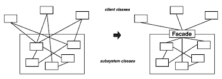

# 퍼사드 패턴   Fecade Pattern

* 서브시스템에 있는 일련의 인터페이스를 통합 인터페이스로 묶어줌
* 고수준 인터페이스도 정의해서 서브 시스템을 더 편리하게 이용할 수 있다

### 다이어그램

<figure><figcaption></figcaption></figure>

### 사용

* 복잡한 서브 시스템에 대한 단순한 인터페이스 제공이 필요할 때
* 사용자 - 서브시스템 간의 결합도를 낮추고 싶을 때

### 장점

* 서브시스템 구성 요소를 보호하고 사용자가 알아야하는 객체의 수가 줄어듬
* 서브시스템 내에 정의된 요소들 간에는 결합도가 강하더라도, 사용자와 서비시스템간의 결합도는 낮아짐
  * 서브시스템 요소의 다양화 작업을 보다 쉽게 수행할 수 있음
* 필요하다면 사용자가 직접 서브시스템 클래스에 접근해서 사용할 수도 있음

## 디자인 원칙

### 최소 지식 원칙Principle of Least Knowledge

* 객체 사이의 상호작용은 될 수 있으면 아주 가까운 ‘친구’ 사이에서만 허용하자
* 어떤 객체든 그 객체와 상호작용을 하는 클래스의 개수와 상호작용 방식에 주의를 기울여야 한다
* 여러 클래스들이 서로 복잡하게 의존하지 않도록 하자
