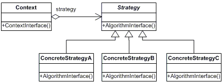

# 전략 패턴 Strategy Pattern

## **전략패턴 Strategy Pattern**

* 알고리즘군을 정의하고 캡슐화해서 각각의 알고리즘군을 수정해서 쓸 수 있게 해준다&#x20;
  * 캡슐화된 알고리즘 == 전략
* 클라이언트로부터 알고리즘을 분리해서 독립적으로 변경할 수 있다
* 다른 클래스에 행동을 위임한다
  * 위임 : 요청을 수행하는 추상화한 전략 객체에 특정 요청을 위임 -> 처리를 전달하는 객체를 변경시키지 않고 객체의 행동을 변경할 수 있음

<figure><figcaption>
변화하는 부분을 추출해서 캡슐화된 알고리즘군(Strategy)을 구현
</figcaption></figure>

### 예제)

* 오리의 꽥꽥 거리는 행동과 나는 행동을 각각 QuakBehavior, FlyBehavior로 묶고, 각각의 상세 행동 클래스를 구현 ex) FlyWithWings(), FlyNoWay() ...
* Duck은 quakBehavior와 FlyBehavior로 행동을 위임

<figure><figcaption></figcaption></figure>

## 전략 패턴을 사용할 수 있는 상황

* 행동들이 조금씩 다를 뿐 개념적으로 관련된 많은 클래스들이 존재할 때 -> 많은 행동 중 하나를 가진 클래스를 구성
* 알고리즘의 변형이 필요할 때
* 사용자가 몰라야 하는 데이터를 사용하는 알고리즘이 있을 때
* 하나의 클래스가 많은 행동을 정의하고, 이런 행동들이 그 클래스의 연산 안에서 복잡한 다중 조건문의 모습을 취할 때

## 전략 패턴의 장점

* 동일 계열의 관련 알고리즘군, 행동군을 정의 -> 재사용 가능
* 상속을 대체할 수 있음 -> 상속을 사용하면 변경이 발생했을 때 수정이 어렵고, 이해하기도 어렵고 유지보수가 어려움
* 조건문 제거 가능 -> 행동을 하나로 묶고 캡슐화하면 조건문을 없앨 수 있음
* 구현 선택 가능

## 전략 패턴의 단점

* 사용자가 전략의 구현내용을 이미 알고 있어야 함
* 객체 수 증가\

## 상속의 문제점

* 서브 클래스에서 코드가 중복됨
* 실행 시에 특징을 바꾸기 힘듬 (컴파일 시점에 결정됨)
* 모든 서브 클래스의 행동을 알기 힘듬
* 코드를 변경 했을 때 영향 범위를 정확히 파악하기 어려움
* 부모 클래스의 구현이 서브 클래스에 다 드러나기 때문에 캡슐화 위반으로 볼 수도 있음

예) 상위 구현의 규격이 변경될 때 마다 모든 서브클래스를 변경해야 함 상황에 따라 일일히 오버라이드 해줘야 함

## 디자인 원칙

### 어플리케이션에서 달라지는 부분을 찾아내고, 달라지지 않는 부분과 분리한다

* 달라지는 부분을 찾아서 캡슐화 -> 코드 변경 시 의도치 않는 사이드를 줄여서 시스템의 유연성 향상

### 구현보다는 인터페이스에 맞춰서 프로그래밍한다 (상위 형식에 맞춰서 프로그래밍한다)

* 상위 형식에 맞춰서 프로그래밍하면 상세 구현 형식을 몰라도 됨
  * Dog d = new Dog(); d.bark(); -> 상세 구현에 의존, 구체적인 Dog 구현을 알아야 함
  * Animal animal = getAnimal(); animal.makeSound(); -> Animal 하위 어떤 구체적인 형식인지는 모르지만 makeSound() 라는 반응을 할 수 있으면 됨

### 상속보다는 구성Composition을 활용한다

* 구성 : “A에는 B가 있다” 행동을 위임하도록 클래스를 합치는 것

? 상속을 써야만 하는 순간은 어떤 거지?

## 디자인 패턴을 알아야 하는 이유

* 패턴 수준에서 생각 -> 아키텍쳐를 생각하는 수준도 끌어올려줌, 디자인 수준에 초점을 맞출 수 있게 됨
* 패턴과 전문 용어로 소통할 때 간단하고 효율적으로 의사소통이 가능!
