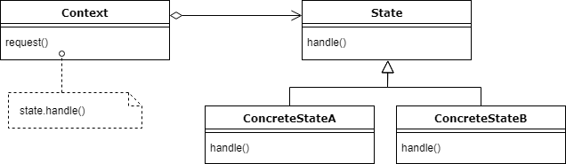

# 1.5 Operating-System Operations

## interrupt or trap (exception)

* modern operating system is **interrupt driven**
  * If there is no processes to execute, no I/O devices to service, no users to respond, the os will sit quietly waiting for events
* **trap (exception)**
  * software-generated interrupt
    * caused by...
      * error (ex. division by zero, invalid memory access)
      * specific request from a user program
  * for each type of interrupt, there are separate segments of code in os to determine what actions should be taken
    * an interrupt service routine is provided to deal with interrupt
* need **protection**&#x20;
  * that an incorrect (or malicious) program can not cause other programs to execute incorrectly&#x20;
  * since os and user share hardware and software, one error can affect other programs
  * we need to make sure that **an error in a user program could cause problem only for the one program running**

## **1.5.1 Dual-Mode and Multimode Operation**

### 1) dual mode

In order to ensure the proper execution of the operating system, we must be able to distinguish between the execution of **operating system code** and **user-defined code**

when a user application request a service from the operating system (via **system call**), the system must transition from user to kernel mode to fulfill the request

#### kernel mode

* also called, supervisor mode / system mode / privileged mode
* at system boot time, hardware stars in kernel mode
  * operating system is then loaded and stars user applications in user mode
  * whenever trap or interrupt occurs, hardware switches modes (by changing the state of the **mode bit**)
* operating system gains control of computer in kernel mode

#### user mode

* system switches to user mode before passing control to a user program (set mode bit to 1)

#### why do we need dual mode

* protect the operating system from errant users
  * **privileged instruction**
    * designated machine instruction that only runs in kernel mode
      * ex) instruction to switch to kernel mode / I/O control / timer management, interrupt management
    * prevent errant user controlling over the system (privileged instruction can not be executed in user mode, rather hardware consider it as illegal and traps it to the os)

### 2) multi mode

sometimes different modes are used by various kernel component, and CPU designer may use other methods to differentiate operational privilege

#### virtual machine manager (VMM)

* CPUs that support virtualization frequently have a separate mode to indicate when VMM is in control of the system
* VMM has more privileges than user process, but fewer than kernel

### life cycle of instruction execution in computer system

* Initial control resides in the operating system, where instructions are executed in kernel mode
* when control is given to user application, the mode is set to user mode
* control is switched back to the operating system via **interrupt, trap, system call**&#x20;

#### **system call**

* provide the means for a user program to ask the operating system to perform tasks
  * reserved for the os on the user program's behalf
* method used by a process to request action by the operating system
* takes the form of a **trap** to a specific location in the **interrupt vector**
  * trap can be executed by a generic trap instruction, or specific `syscall` instruction to invoke a system call&#x20;

